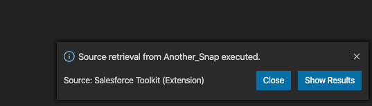
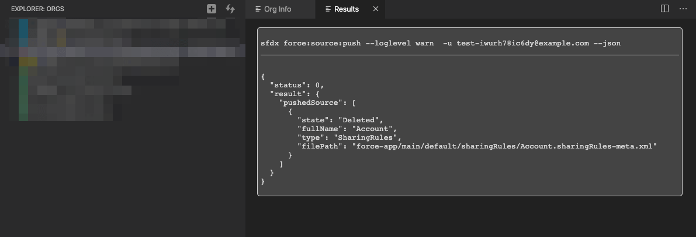

# Visual Studio Code Salesforce Toolkit

 

This extension is designed to support developers with Salesforce DX projects. Provides quick visual access to scratch orgs, sandboxes, and other useful features.
The icon will appear if the workspace contains the Salesforce's DX project `force-app/` directory.

**Note:** Requires [SFDX CLI](https://developer.salesforce.com/tools/sfdxcli) installed.

# Main Features

### Orgs Explorer

Shows the Orgs (Dev Hubs, Sandboxes and Scratch Orgs) with different icon colors depending on the type.
On mouse hover, there are quick actions available (Open, Setup, Delete, Set as default)

Color code:
* Blue = Dev Hub
* Green = Sandbox
* Gray = Scratch Org
* Yellow = Default Scratch Org

___

### Org Info Panel

Clicking on an org from the Org Explorer, opens a practical all-in-one Info Panel for the org selected.

Info & Actions available:
* Quick view for Org Id, Release, API Version, Type and username
* Change Alias
* Show Access Token
* Show quick Link (Scratch orgs only). This link allows anyone to access to the org without login! 
* Open org Homepage / Setup Page / Deployment Status Page
* Logout from org
* Run Unit Tests (RunLocalTests)
* Deploy source
* SOQL Query tool
* REST API Explorer

___

### Results Viewer Panel

After performing source push or pull operations, clicking on the "Show Results" button of the notification

You will access a page with the output of the DX command, in JSON.

___

**Enjoy!**
 
This software is free of charge, opensource, and it's developed during my spare time. If you feel that you want to contribute, you can:

___

Icons made by [Smashicons](https://www.flaticon.com/authors/smashicons) from [www.flaticon.com](https://www.flaticon.com/)
